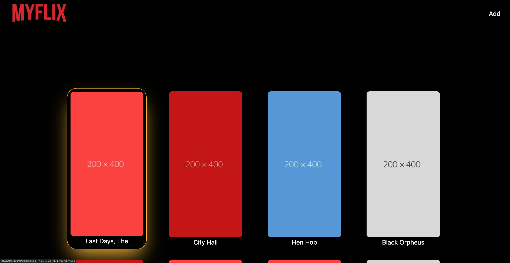

# TP 6 - MyFlix NextJS

L'objectif du TP est de découvrir NextJS, les différentes méthodes de générations ainsi que l'Incrémental Static Regeneration

## Steps

1. Créer une page Home
2. Récupérer les Movies depuis notre backend
3. Afficher les Movies
4. Pouvoir sélectionner un Movie et aller sur la page
5. Récupérer les infos de ce movie
6. Créer une page Add pour ajouter un movie
7. Faire en sorte d'utiliser l'ISR pour récupérer notre dernier movie

Le lien utile:

- [Doc de NextJS](https://nextjs.org/docs/getting-started)
